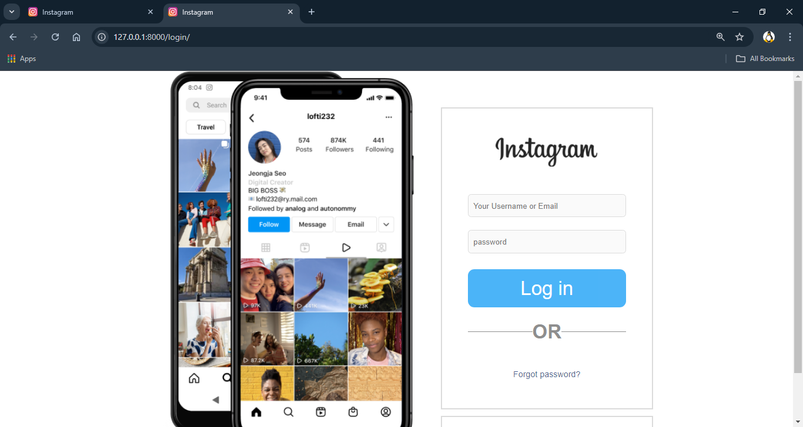
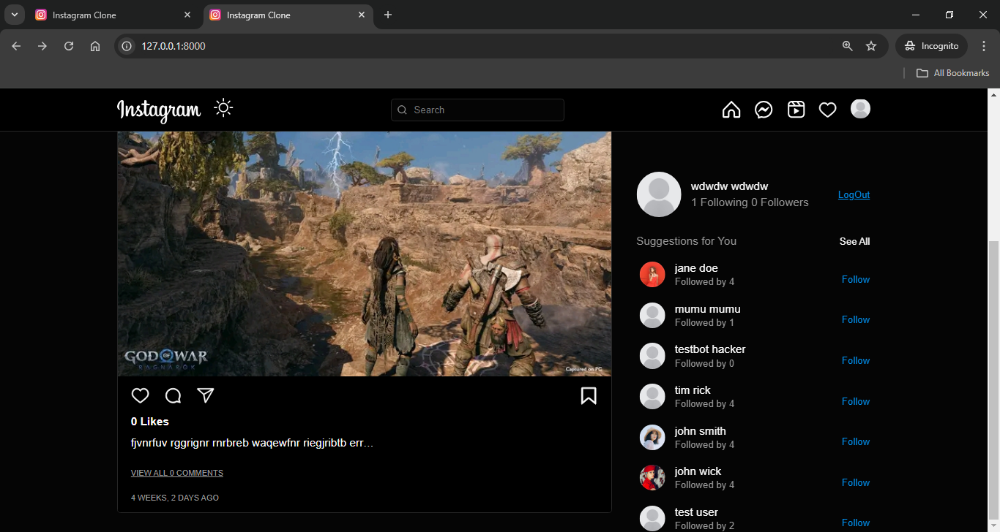

### Instagram Clone with Django
- clone the Repository 📌
```bash
git clone https://github.com/RaphaelApeh/instagram-clone.git
```
- Install requirements
```bash
pip install -r requirements.txt
```
- Set in `.env` ⚙

```python
DJANGO_SECRET_KEY=""
DJANGO_DEBUG=True
```
- 🛠 Working Dir
```bash
cd src/
```
- Migrate
```bash
python manage.py migrate
```
- <h1>Preview 😘</h1>
- Login<br/>



- Page
